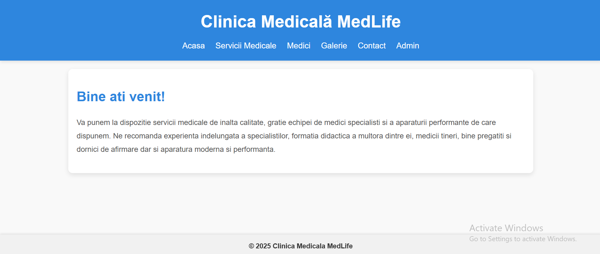
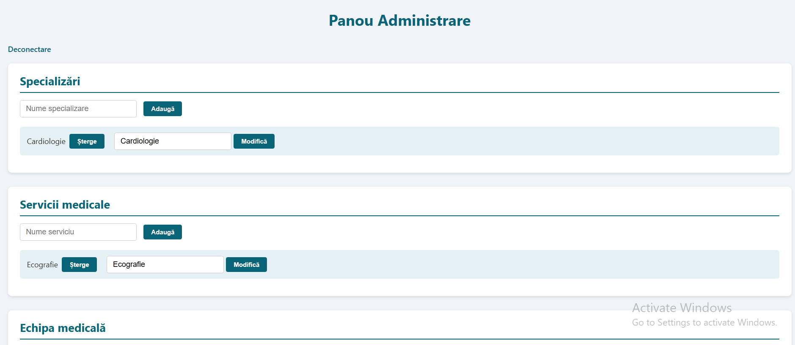

<h1 align="center"><strong><em>Medical Management System</strong></em></h1>

  
# How to run the app?

To run this application: 
 

* Create a schema in the database called "Clinica".
* Clone the repository and run the app using a Live Server.

<h1 align="center"><strong>Demonstration</strong></h1>
 
<h2 align="center"><strong>Main Page</strong></h2>

 
<h2 align="center"><strong>Admin Dashboard</strong></h2>

